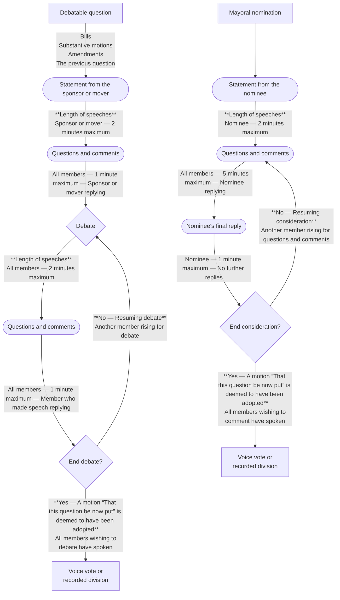

# Process of Debate

*Last revised 16 December 2024*
> [!note]
> This infographic is published for reference only. Refer to the [Standing Orders](Standing%20Orders.md) as the original authority for matters of procedure.
---

---
